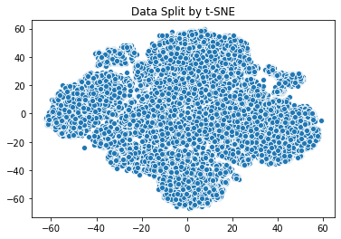
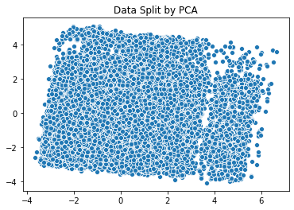
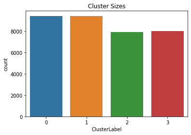
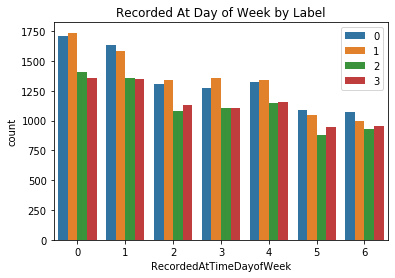
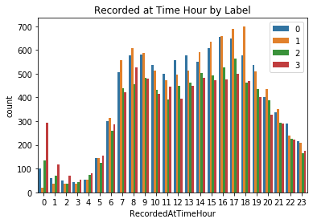
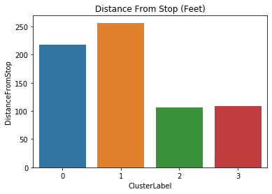

# New-York-Bus-Clustering

Clustering New York City Buses to learn if there is a way to pick out patterns of late busses. The data was obtained from a New York City MTA buses data stream service and can be located in [This Kaggle Link](https://www.kaggle.com/stoney71/new-york-city-transport-statistics?select=mta_1710.csv). 

To determine the best method of clustering, PCA and t-SNE was applied to KMeans and Agglomerative Clustering. KMeans with t-SNE proved to be the best way to cluster the New York City Buses dataset.

## Methodology

### KMeans Clustering

K values of 3-10 were chosen and compared to decide what the most accurate amount of clusters should be. PCA and t-SNE was applied to each cluster, and the silhouette scores were calculated. 

### Agglomerative Clustering

Three different measurements of linkage for Agglomerative Clustering were used:
* Complete
* Average
* Ward

Once again, PCA and t-SNE was applied to each cluster and n_clusters was set to 4-10 for each linkage measurement.

### Comparing Dimensionality Reduction Methods

To determine the amount of components used for PCA, the cumulative sum was calculated to equate to 90% variance. This resulted in 10 components and explains why n_components = 10 was chosen when using PCA. As for t-SNE, a more global approach was taken to try to group up the data, and therefore a perplexity of 50 was used. 

Scatterplots were created for t-SNE and PCA when applied to the data. Comparing the two charts, t-SNE was able to separate and group up the data much more efficiently than PCA.

## Results

### Silhouette Scores

To determine the best clustering method and best dimensionality reduction method the silhouette scores were calculated and compared. 

#### KMeans with PCA Silhouette Score Results:

* 3 clusters: 0.111
* 4 clusters: 0.115
* 5 clusters: 0.104
* 6 clusters: 0.100
* 7 clusters: 0.099
* 8 clusters: 0.095
* 9 clusters: 0.096
* 10 clusters: 0.097

#### KMeans with t-SNE Silhouette Score Results:

* 3 clusters: 0.397
* **4 clusters: 0.427**
* 5 clusters: 0.414
* 6 clusters: 0.379
* 7 clusters: 0.385
* 8 clusters: 0.387
* 9 clusters: 0.395
* 10 clusters: 0.391

#### Agglomerative Clustering with t-SNE and complete linkage:

* 4 clusters is: 0.282
* 5 clusters is: 0.273
* 6 clusters is: 0.293
* 7 clusters is: 0.291
* 8 clusters is: 0.253
* 9 clusters is: 0.231
* 10 clusters is: 0.219

#### Agglomerative Clustering with t-SNE and average linkage:

* 4 clusters is: 0.417
* 5 clusters is: 0.361
* 6 clusters is: 0.311
* 7 clusters is: 0.299
* 8 clusters is: 0.271
* 9 clusters is: 0.258
* 10 clusters is: 0.242

#### Agglomerative Clustering with t-SNE and ward linkage:

* 4 clusters is: 0.392
* 5 clusters is: 0.392
* 6 clusters is: 0.368
* 7 clusters is: 0.348
* 8 clusters is: 0.333
* 9 clusters is: 0.333
* 10 clusters is: 0.335

#### Agglomerative Clustering with PCA and complete linkage:

* 4 clusters is: 0.028
* 5 clusters is: 0.019
* 6 clusters is: 0.008
* 7 clusters is: -0.002
* 8 clusters is: 0.001
* 9 clusters is: 0.002
* 10 clusters is: 0.003

#### Agglomerative Clustering with PCA and average linkage:

* 4 clusters is: 0.050
* 5 clusters is: 0.051
* 6 clusters is: 0.050
* 7 clusters is: 0.033
* 8 clusters is: 0.026
* 9 clusters is: 0.019
* 10 clusters is: 0.014

#### Agglomerative Clustering with PCA and ward linkage:

* 4 clusters is: 0.044
* 5 clusters is: 0.048
* 6 clusters is: 0.037
* 7 clusters is: 0.026
* 8 clusters is: 0.030
* 9 clusters is: 0.023
* 10 clusters is: 0.021

##### The best silhouette score was obtained from KMeans with t-SNE and K = 4, therefore this clustering and dimensionality method was used for more analysis.

### Findings

From the dataset, four clusters were identified, each having similar sizes. 

The Recorded Day of Week, Recorded Arrival Hour, and Average Distance From Stop features were used to help classify clusters.

#### Cluster 0 Features:

* Classified as the afternoon bus routes as it is most frequent from 10 AM - 1 PM
* Consists of the bus routes mostly used during the weekend

#### Cluster 1 Features:

* Classified as the morning and evening rush hour bus routes as it is most frequently used between the hours 6 AM - 9 AM and 2 PM - 6 PM
* Consist of the bus routes mostly used during the week
* Farthest average distance from stop (classified as latest bus routes)

#### Cluster 2 Features: 

* Closest average distance from stop (classified as the most on time bus routes)

#### Cluster 3 Features:

* Used as the very early morning bus routes as it is most frequent within the hours of 12 AM - 5 AM
